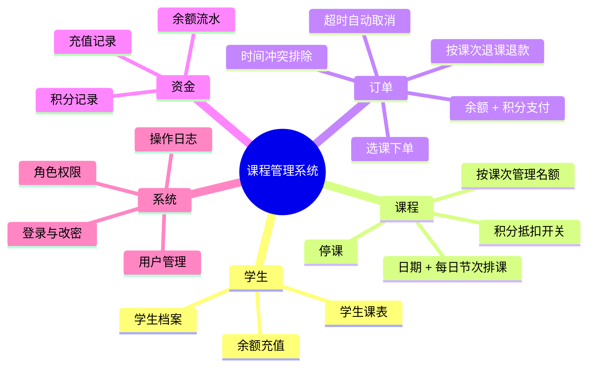
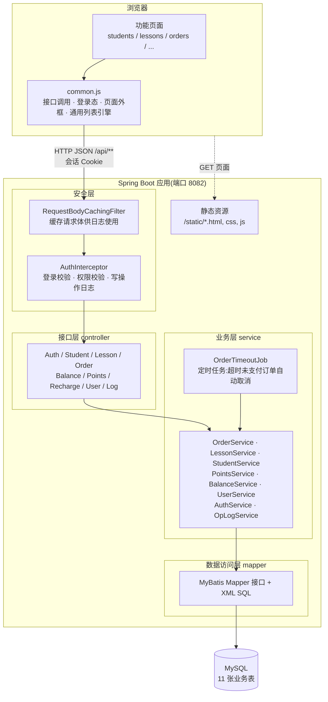
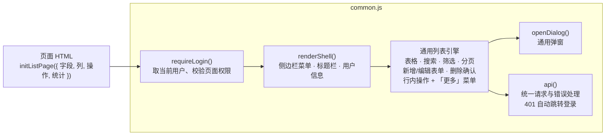
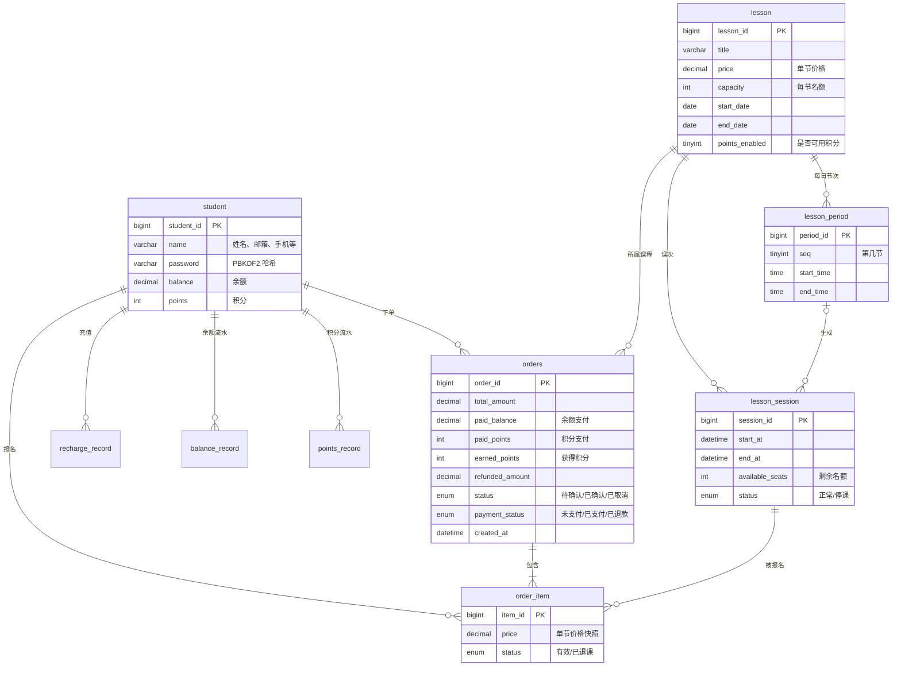
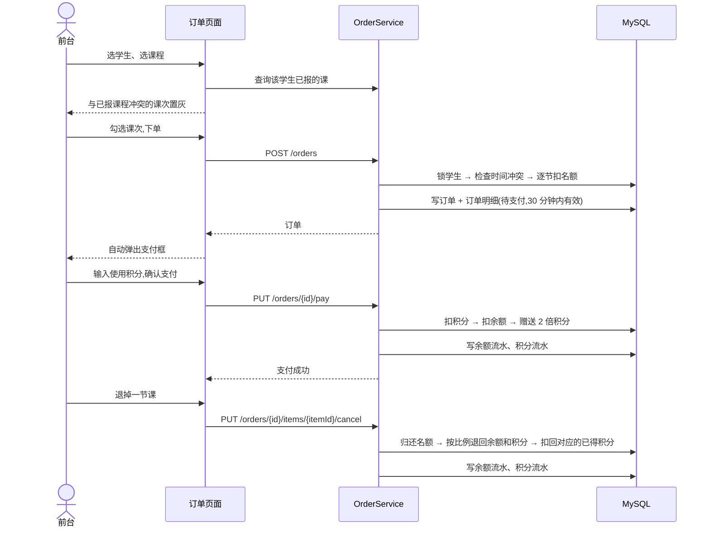
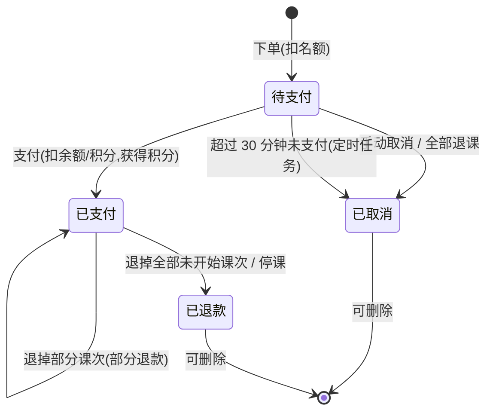
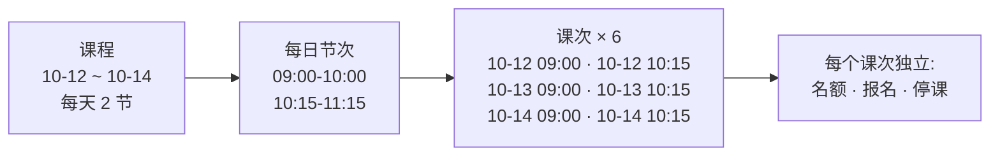
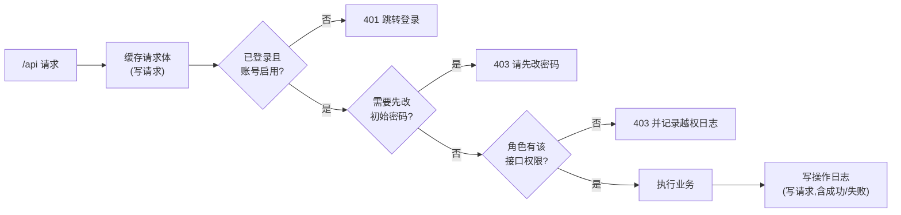

# 课程管理系统 · 架构与功能说明

一个面向培训机构的**课程报名与收费管理后台**。机构员工用它维护学生和课程排课、为学生选课下单、用「余额 + 积分」收费,并在退课时按原支付方式退款;所有资金变动和员工操作都有流水和日志可查。

- **后端**:Java 17 · Spring Boot 4.1 · Spring MVC · MyBatis · MySQL 8
- **前端**:原生 HTML / CSS / JavaScript,无框架、无构建步骤,由 Spring Boot 直接提供静态页面
- **使用者**:机构内部员工(管理员 / 前台 / 教务),学生本人不登录系统

---

## 目录

1. [功能地图](#1-功能地图)
2. [整体架构](#2-整体架构)
3. [后端模块](#3-后端模块)
4. [前端架构](#4-前端架构)
5. [数据模型](#5-数据模型)
6. [核心业务流程](#6-核心业务流程)
7. [权限与安全](#7-权限与安全)
8. [功能说明](#8-功能说明)
9. [运行与配置](#9-运行与配置)

---

## 1. 功能地图



| 业务域 | 解决的问题 |
|---|---|
| **学生** | 学生档案、余额充值,以及"这个学生报了哪些课、上到第几节" |
| **课程** | 一门课有起止日期、每天若干节,系统自动展开成一节节「课次」,名额按课次控制 |
| **订单** | 为学生挑选课次下单,自动避开时间冲突;支付、退课、超时取消 |
| **资金** | 余额和积分的每一笔变动都有流水,可对账 |
| **系统** | 员工账号、三种角色的菜单与权限、全量操作日志 |

---

## 2. 整体架构

系统是典型的**前后端分离单体应用**:浏览器里的静态页面通过 JSON 接口调用后端,后端分为「安全层 → 接口层 → 业务层 → 数据访问层」四层,数据全部存储在 MySQL。



### 各层职责

| 层 | 组件 | 职责 |
|---|---|---|
| **前端** | `static/*.html` + `js/common.js` | 页面渲染、表单与弹窗、调用接口;按当前用户角色显示菜单和按钮 |
| **安全层** | `AuthInterceptor`、`RequestBodyCachingFilter`、`ErrorCaptureResolver` | 每个 `/api` 请求先校验登录和权限;写请求结束后记录操作日志 |
| **接口层** | `controller/*Controller` | 定义 REST 接口,只做参数接收和结果返回 |
| **业务层** | `service/*Service` | 全部业务规则:排课、下单、支付、退款、积分、流水;事务边界在这一层 |
| **数据访问层** | `mapper/*Mapper` + `resources/mapper/*.xml` | SQL 读写;名额、余额、积分的扣减都用**条件更新**防止超卖和扣成负数 |
| **定时任务** | `OrderTimeoutJob` | 每分钟检查一次,取消下单超过 30 分钟仍未支付的订单 |

### 关键设计决定

- **名额按「课次」管理,而不是按课程**:同一门课不同日期的余位不同,学生可以只选其中几节。
- **钱和积分都用"分"计算**:100 积分 = 1 元,即 1 积分 = 1 分钱,积分与金额互换没有舍入误差。
- **每一笔资金变动都写流水**:余额流水、积分流水与余额、积分在同一事务里更新,保证「流水合计 = 当前余额」。
- **权限在后端强制**:前端隐藏菜单只是体验,真正的拦截在 `AuthInterceptor`,未登记的接口一律拒绝。
- **并发安全靠数据库**:扣名额 / 扣余额 / 改订单状态都是 `UPDATE … WHERE 条件`,返回 0 行即说明被抢先或不满足条件,整体回滚。

---

## 3. 后端模块

```
com.example.demo
├── controller   接口层    9 个 Controller
├── service      业务层    6 个 Service + 1 个定时任务
├── mapper       数据访问  11 个 Mapper(SQL 在 resources/mapper/*.xml)
├── model        实体      11 个实体,对应 11 张表
└── security     安全      登录、权限、密码哈希、操作日志
```

| 模块 | 主要类 | 负责 |
|---|---|---|
| **学生** | `StudentController` → `StudentService` | 学生增删改查、充值(同时写充值记录、余额流水、赠送积分) |
| **课程排课** | `LessonController` → `LessonService` | 课程增删改;按「日期范围 × 每日节次」生成和同步课次;已有报名的课次受保护 |
| **订单** | `OrderController` → `OrderService` | 下单(冲突检查、扣名额)、支付(余额 + 积分)、退课 / 取消 / 停课退款、超时取消 |
| **积分** | `PointsController` → `PointsService` | 积分规则常量、积分流水 |
| **余额** | `BalanceController` → `BalanceService` | 余额流水 |
| **充值记录** | `RechargeRecordController` | 充值明细(含赠送积分) |
| **用户** | `UserController` → `UserService` | 员工账号管理;保证至少一个启用的管理员 |
| **登录** | `AuthController` → `AuthService` | 登录、退出、改密码、登录失败锁定 |
| **安全基础** | `Role`、`PasswordHasher`、`SecurityBootstrap`、`WebConfig` | 角色→权限→菜单的唯一定义;PBKDF2 密码哈希;首次启动创建管理员 |
| **操作日志** | `LogController` → `OpLogService` | 日志写入与查询;密码字段打码 |
| **定时任务** | `OrderTimeoutJob` | 超时未支付订单自动取消 |

---

## 4. 前端架构

前端不使用框架,所有页面共享一个 `common.js`,每个页面只用一段**声明式配置**描述自己:



| 页面 | 说明 | 主要复用 |
|---|---|---|
| `login.html` | 登录 | `api()` |
| `students.html` | 学生 | 列表引擎 + 充值弹窗 |
| `lessons.html` | 课程 | 列表引擎 + 节次编辑器 + 课次弹窗 |
| `orders.html` | 订单 | 列表引擎 + 自定义下单弹窗 + 支付弹窗 + 明细弹窗 |
| `recharges.html` / `balance.html` / `points.html` | 三类流水 | 列表引擎(只读) |
| `schedule.html` | 学生课表 | 页面外框 + 自定义布局 |
| `users.html` / `logs.html` | 用户管理 / 操作日志 | 列表引擎 |

**响应式**:宽屏正常显示;1180px 以下侧边栏收成图标栏;900px 以下表格变为卡片;任何宽度都不出现横向滚动。

---

## 5. 数据模型



图中未展开的其他表:

| 表 | 用途 |
|---|---|
| `recharge_record` / `balance_record` / `points_record` | 充值记录、余额流水、积分流水(每条都记录变动后的余额,可关联订单) |
| `sys_user` | 员工账号:用户名、密码哈希、角色、启用状态、是否需要改密码 |
| `operation_log` | 操作日志:类型、操作人、路径、请求内容(密码打码)、结果、IP、耗时 |

**两个重要约束**

- `order_item` 上的唯一索引 `(student_id, session_id, active_flag)`:同一学生同一课次只能有一条**有效**报名(退课后可以重新报)。
- `lesson_session.available_seats BETWEEN 0 AND capacity`、`student.balance >= 0`、`student.points >= 0`:数据库层面保证不超卖、不透支。

---

## 6. 核心业务流程

### 6.1 下单 → 支付 → 退课



### 6.2 订单状态



### 6.3 排课:从课程到课次



修改日期或节次时,系统按开始时间比对已有课次:新增的补上,不再需要的删除;**已有学生报名的课次不能删除或改时间**,整次修改会被拒绝并说明是哪几节。

### 6.4 资金规则

| 规则 | 说明 |
|---|---|
| 积分价值 | 100 积分 = 1 元 |
| 支付获得 | 余额实付 × 2(向下取整);积分抵扣部分不产生积分 |
| 充值赠送 | 充值金额 × 1(向下取整) |
| 组合支付 | 积分最多抵扣全部金额,其余从余额扣;课程可关闭积分抵扣 |
| 退款 | 只退未开始的课次;按原支付方式、按比例退回余额和积分;扣回对应已得积分(不够扣则扣到 0) |
| 停课 | 该课次所有报名自动退课退款 |
| 超时 | 下单后 30 分钟未支付自动取消,归还名额 |

---

## 7. 权限与安全

### 7.1 一个请求经过的检查



### 7.2 角色权限

角色、权限、菜单的对应关系只在 `security/Role.java` 一处定义。

| 权限 | 管理员 | 前台 | 教务 |
|---|:-:|:-:|:-:|
| 查看学生 / 学生课表 | ✅ | ✅ | ✅ |
| 维护学生、充值 | ✅ | ✅ | |
| 查看课程 | ✅ | ✅ | ✅ |
| 维护课程、停课 | ✅ | | ✅ |
| 下单、支付、退课 | ✅ | ✅ | |
| 充值记录 / 余额流水 / 积分记录 | ✅ | ✅ | |
| 用户管理 | ✅ | | |
| 操作日志 | ✅ | | |

### 7.3 安全措施

| 方面 | 做法 |
|---|---|
| 密码存储 | PBKDF2-HMAC-SHA512,随机盐,210000 次迭代;员工和学生密码都只存哈希 |
| 首次登录 | 初始密码必须修改;修改前不能访问任何数据 |
| 会话 | 登录后换发新会话(防会话固定);Cookie `HttpOnly` + `SameSite=Strict` |
| 暴力破解 | 同一用户名连续 5 次错误锁定 5 分钟 |
| 权限变更 | 每次请求重新读取用户,停用账号或改角色立即生效 |
| 操作审计 | 登录、所有写操作、越权访问、系统自动操作都记日志;密码字段打码 |
| 数据一致性 | 条件更新 + 行锁;加锁顺序统一为「学生 → 订单 → 课次」,避免死锁 |

---

## 8. 功能说明

| 菜单 | 主要功能 |
|---|---|
| **学生** | 新增 / 编辑 / 删除学生;充值(显示赠送积分);查看余额和积分;快捷进入该生的课表、充值记录、余额流水、积分记录 |
| **课程** | 新增课程时设置日期、每日节次、名额、单节价格、是否可用积分;从已有课程复制;查看每个课次的报名情况并停课 |
| **订单** | 下单时按学生排除冲突课次;下单后立即支付;支付框显示积分抵扣、余额支付、可得积分和支付截止时间;查看明细、退单节课、取消订单 |
| **充值记录** | 每笔充值金额、充值后余额、赠送积分 |
| **余额流水** | 开户、充值、支付、退款的每一笔余额变动 |
| **积分记录** | 支付获得、充值赠送、抵扣、退回、扣回的每一笔积分变动 |
| **学生课表** | 选择学生,查看在读课程进度和按天排列的课表(待上 / 已上 / 已退) |
| **用户管理** | 新增员工账号、分配角色、停用、重置密码 |
| **操作日志** | 按类型筛选(登录 / 操作 / 越权 / 系统),搜索用户、IP、内容、失败原因 |

---

## 9. 运行与配置

### 环境

JDK 17+、MySQL 8。项目自带 Maven Wrapper,无需单独安装 Maven。

### 启动步骤

1. 创建数据库 `test`,按版本顺序执行 `src/main/resources/db/` 下的 `V2` → `V10` 脚本。
   > 最初的 `student`、`lesson`、`orders` 三张基础表尚无 `V1` 建表脚本,全新环境需先从已有库导出表结构(`mysqldump --no-data`)。
2. 在 `src/main/resources/application.yaml` 中填写数据库连接。
3. 启动:`./mvnw spring-boot:run`(或在 IDEA 中运行 `DemoApplication`)。
4. 访问 **http://localhost:8082/login.html**。首次启动会自动创建管理员 `admin`,随机初始密码只在启动日志中打印一次(搜索「已创建初始管理员账号」)。
5. (可选)生成演示数据:`node scripts/seed-demo-data.js`(50 个学生、10 门课程)。

### 主要配置项

| 配置 | 默认 | 说明 |
|---|---|---|
| `server.port` | `8082` | 服务端口 |
| `server.servlet.session.timeout` | `2h` | 会话无操作过期时间 |
| `app.orders.pay-timeout-minutes` | `30` | 下单后的支付时限 |
| `app.orders.timeout-check-ms` | `60000` | 超时订单检查间隔 |
| `app.security.admin-reset-enabled` | `false` | 登录页「重置管理员密码」入口,仅限本地开发,上线必须关闭 |

### 已知限制

- 缺少 `V1` 基础表建表脚本;迁移脚本尚未接入 Flyway 自动执行
- 暂无自动化测试
- 列表数据在前端分页,数据量大时需改为后端分页;操作日志暂无自动清理
- 数据库账号密码写在 `application.yaml` 中,部署前应改为环境变量
