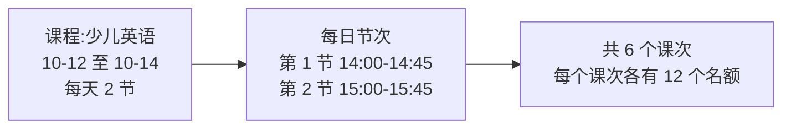

# 课程管理系统 用户指导手册

| 项目 | 内容 |
|---|---|
| 文档名称 | 课程管理系统用户指导手册 |
| 文档版本 | V1.0 |
| 编写日期 | 2026-09-30 |
| 适用对象 | 机构管理员、前台 / 财务人员、教务老师 |

---

## 1. 写在前面

### 1.1 本系统能做什么

课程管理系统帮助机构完成日常的**排课、报名、收费、退费和对账**：

- 教务老师设置课程的上课日期和每天的上课时间，系统自动生成每一节课（课次）；
- 前台为学生选课下单，系统自动避开名额已满和时间冲突的课；
- 学生用账户余额和积分付款，退课时系统自动算好该退多少、退到哪里；
- 每一笔钱、每一个积分的去向都有记录，随时可查。

### 1.2 你是哪种角色

登录后看到的菜单取决于你的角色。不确定自己是什么角色，可以看左下角的用户信息。

| 角色 | 你能看到的菜单 | 你的主要工作 |
|---|---|---|
| **管理员** | 全部菜单 | 所有业务，外加管理员工账号、查看操作日志 |
| **前台** | 学生、课程（只看）、订单、充值记录、余额流水、积分记录、学生课表 | 登记学生、充值、下单收费、退课、查账 |
| **教务** | 课程、学生课表 | 排课、调整课程、停课、查看学生课表 |

> 如果你找不到某个菜单或按钮，通常是因为你的角色没有这项权限，请联系管理员。

### 1.3 本手册怎么读

- 第 2 章介绍登录和界面，**所有人都应阅读**；
- 第 3~9 章按工作任务编写，只看和自己工作有关的部分即可；
- 第 10 章解释费用和积分是怎么算的；
- 第 11 章是常见问题，遇到提示看不懂时可以先查这里。

---

## 2. 快速入门

### 2.1 登录

1. 在浏览器中打开系统地址（由管理员提供，例如 `http://服务器地址:8082/login.html`）。
2. 输入**用户名**和**密码**，点击「登录」。密码框右侧的「显示」可以查看输入的密码。
3. 登录成功后自动进入你有权限的第一个页面。

**第一次登录**：如果你的账号是新建的，或刚被管理员重置过密码，登录后会弹出「请修改初始密码」对话框。依次填写初始密码、新密码、确认新密码，点击「保存」。**不修改密码无法使用系统**。

新密码要求：**8~64 位，同时包含字母和数字**。

> **登录失败怎么办**
> - 提示“用户名或密码错误”：检查大小写锁定和输入法。
> - 提示“密码错误次数过多”：连续输错 5 次会锁定 5 分钟，等 5 分钟后再试。
> - 提示“该账号已停用”：请联系管理员。
> - 忘记密码：请管理员在「用户管理」中为你重置密码。

### 2.2 界面介绍

| 区域 | 说明 |
|---|---|
| ① 左侧菜单栏 | 上方是功能菜单，当前页面高亮；下方显示你的姓名和角色，🔑 图标修改密码，退出图标退出登录；最下方显示系统连接状态 |
| ② 标题栏 | 页面名称和说明，右侧是当前时间 |
| ③ 统计卡片 | 当前页面的汇总数字，例如学生总数、余额总计 |
| ④ 工具栏 | 搜索框（输入即筛选）、下拉筛选、「刷新」、「新增」按钮 |
| ⑤ 列表 | 每行一条记录；一个格子里可能有上下两行信息，例如学生姓名下面是邮箱 |
| ⑥ 分页 | 显示共多少条，「上一页」「下一页」翻页 |

**行内操作和「更多」菜单**：每行右侧最多直接显示两个常用按钮，其他操作（如删除、查看记录）收在「更多 ▾」里，点击展开，点空白处或按 Esc 收起。

**窗口较窄时**：左侧菜单栏会收成只有图标（鼠标悬停显示名称）；在手机或很窄的窗口上，列表会变成一张张卡片，每个字段前面有名称。

### 2.3 修改密码和退出

- **修改密码**：点击左下角的 🔑 图标，输入原密码和两次新密码，点击「保存」。
- **退出登录**：点击左下角的退出图标。离开电脑前请务必退出。
- 超过 2 小时没有操作会自动退出，需要重新登录。

### 2.4 通用操作习惯

- **所有删除、退课、停课、取消、支付操作都会先弹出确认框**，确认框会写清楚后果（比如退多少钱），仔细看过再点确认。
- 操作成功后屏幕下方会短暂显示提示；操作失败时，对话框里会用红字说明原因，对话框不会关闭，修改后可以重新提交。
- 数据由多人同时使用，如果看到的内容可能过时，点击「刷新」。

---

## 3. 学生管理（管理员、前台）

### 3.1 新增学生

1. 进入「学生」，点击「新增学生」。
2. 填写信息：

| 字段 | 说明 |
|---|---|
| 姓、名 | 必填 |
| 邮箱 | 必填，不能与其他学生重复 |
| 密码 | 必填，至少 6 位（为以后学生端预留，目前学生不登录系统） |
| 手机、出生日期 | 选填 |
| 初始余额（元） | 选填，0~100000；**初始余额不赠送积分**，以后的充值才赠送 |

3. 点击「添加」。

### 3.2 编辑和删除学生

- **编辑**：点击学生行的「编辑」。密码留空表示不修改。**余额不能在这里修改**，只能通过充值、支付、退款变化。
- **删除**：点击「更多 ▾」→「删除」。已经下过订单的学生不能删除。

### 3.3 为学生充值

学生线下交费后，在系统中为其充值：

1. 在学生行点击「充值」。
2. 输入**充值金额（元）**，0.01~100000，最多两位小数。
3. 点击「充值」。

充值后系统自动：
- 增加学生余额；
- **每充值 1 元赠送 1 积分**（不足 1 元的部分不送，例如充 ¥123.45 送 123 积分）；
- 记录一条充值记录和一条余额流水。

### 3.4 查看学生的相关记录

在学生行点击「更多 ▾」，可以直接跳转到该学生的：

- **课表**：报了哪些课、上到第几节；
- **充值记录**：每次充了多少、送了多少积分；
- **余额流水**：余额的每一笔变动；
- **积分记录**：积分的每一笔变动。

---

## 4. 课程管理（管理员、教务；前台只能查看）

### 4.1 认识“课程”和“课次”

一门课程有开课日期、结课日期，以及每天固定的几节课。保存课程后，系统会把**每一天的每一节**都生成一个「课次」。**名额、报名、停课都按课次计算**，学生可以只报其中几节。

### 4.2 新增课程

1. 进入「课程」，点击「新增课程」。
2. 填写信息：

| 字段 | 说明 |
|---|---|
| 从已有课程复制 | 选填。选择后自动填入该课程的全部内容，标题加“（副本）”，可继续修改 |
| 标题 | 必填 |
| 分类 | 选填，例如“数学”“英语”，可用于列表筛选 |
| 单节价格（元） | 学生每报一节课收取的费用 |
| 每节名额 | 每一节课最多多少人 |
| 积分抵扣 | 「支持」：学生可用积分抵扣部分或全部费用；「不支持」：只能用余额付（余额支付仍会获得积分） |
| 开课日期、结课日期 | 跨度不超过 366 天 |
| 每日节次 | 默认一节；点「+ 添加一节」增加（自动接在上一节后 10 分钟、时长相同），点「删除」去掉；每天最多 12 节，各节时间不能重叠 |
| 描述 | 选填 |

3. 点击「添加」，系统自动生成全部课次。

### 4.3 修改课程

点击课程行的「编辑」。修改日期、节次或名额后，系统会自动增加或删除课次。

> **注意**：已经有学生报名的课次**不能被删除，也不能修改下课时间**；每节名额也不能改到少于某一节的已报名人数。如果修改会影响这些课次，系统会拒绝保存并列出是哪几节课。需要调整时，可以先对这些课次停课，或让学生退课。

### 4.4 复制课程

开设相似的新一期课程时，点击「更多 ▾」→「复制」，或在「新增课程」时选择「从已有课程复制」。改一下日期和标题即可保存。

### 4.5 查看课次和停课

1. 在课程行点击「课次」，弹出该课程全部课次：日期、时间、报名人数 / 名额、状态（正常 / 上课中 / 已结束 / 已停课）。
2. 需要取消某一节课时，点击该行的「停课」，确认。

停课后：
- 该节课**所有报名的学生自动退课**，已付款的按原支付方式退款（退余额、退积分）；
- 该节课不能再被报名；
- **停课不能撤销**，请谨慎操作。

### 4.6 删除课程

「更多 ▾」→「删除」。已经有订单的课程不能删除。

### 4.7 课程列表怎么看

| 列 | 说明 |
|---|---|
| 课程 | 标题；下面是分类，标有「不可用积分」的课程只能用余额付 |
| 上课时间 | 日期范围和天数；下面是每天的节次 |
| 单节价格 | 每节课的价格 |
| 报名 / 下节课 | 进度条表示报名人次 / 总名额；下面是课次数和下一节课时间 |

---

## 5. 下单与收费（管理员、前台）

### 5.1 为学生下单

1. 进入「订单」，点击「新增订单」。
2. 选择**学生**。下拉框里会显示学生的当前余额。
3. 选择**课程**。只列出还有未开始课次的课程。
4. 在「选择课次」中勾选要报的课。可以点「全选可选课次」一次选完，或「清空」重选。

   以下课次是**灰色、不能选**的，灰色标签上写着原因：

   | 标签 | 原因 |
   |---|---|
   | 已满 | 名额已报满 |
   | 已停课 | 这节课被取消了 |
   | 已开始 | 上课时间已到或已过 |
   | 已报名 | 这个学生已经报过这节课 |
   | 时间冲突 | 与这个学生已报的**其他课程**时间重叠（鼠标悬停查看冲突的是哪节课） |

5. 下方会显示“已选 N 节 × 单价 = 总价”，以及学生余额够不够。
6. 点击「下单」。

下单成功后，**支付窗口会自动弹出**。

> 先选学生再选课程，系统才能排除该学生的时间冲突；先选课程再选学生也可以，选好学生后课次会自动刷新。

### 5.2 支付订单

支付窗口显示学生的当前余额和积分。

1. 在「使用积分」中输入要用的积分（100 积分抵 1 元）。可以点：
   - 「不用积分」：全部用余额付；
   - 「最多抵扣」：用尽可能多的积分。
2. 下方实时显示：积分抵扣多少钱、余额需要付多少、支付后余额、这一单能获得多少积分。
3. 点击「确认支付」。

**支付规则**

- 用余额支付的部分，每 1 元获得 **2 积分**；用积分抵扣的部分不产生积分。
- 课程设置为「不支持积分抵扣」时，积分输入框是灰色的，只能用余额付。
- 余额或积分不够时，支付会失败并告诉你差多少，不会扣任何钱。余额不够请先去「学生」页充值。

> **支付时限**：订单必须在下单后 **30 分钟**内支付。支付窗口会显示截止时间；订单列表会显示“剩 N 分钟支付”，不足 5 分钟时变红。超时的订单会被系统自动取消、名额释放，需要重新下单。

**暂不支付**：在支付窗口点「返回」，订单保持“待确认 · 未支付”，之后在订单列表中点该订单的「支付」即可（仍需在 30 分钟内）。

### 5.3 查看订单明细

点击订单行的「明细」，可以看到：

- 学生、课程、订单金额、状态、下单时间和支付截止时间；
- 支付方式：余额付了多少、积分用了多少；获得了多少积分；
- 已退款多少（余额和积分分别多少）、扣回了多少积分；
- 每一节课的时间、单价和状态（有效 / 已退课 / 停课退课）。

### 5.4 退掉一节课

1. 在订单「明细」中，找到要退的那节课，点击「退这节课」。
2. 确认框会说明退款去向，点击「退课」。

- 只能退**还没开始**的课；
- 未付款的订单，退课后订单金额相应减少；
- 已付款的订单，**按原支付方式退款**：当初用余额付的退回余额、用积分付的退回积分（按比例拆分），同时**扣回这部分当初获得的积分**。

### 5.5 取消整个订单

点击订单行的「取消订单」，确认。

- 订单中所有**还没开始**的课都会被退掉，并按上面的规则退款；
- 已经开始的课保留、不退款；
- 如果所有课都已经开始，则不能取消。

### 5.6 删除订单

只有**已取消**的订单可以删除：点击订单行的「删除」。删除订单不影响已经发生的余额和积分流水。

### 5.7 订单状态说明

| 状态标签 | 含义 | 可以做什么 |
|---|---|---|
| 待确认 · 未支付 | 已下单，等待支付（30 分钟内） | 支付、明细、取消订单 |
| 已确认 · 已支付 | 已付款；若课次数显示“2 / 3 节”，表示已退掉 1 节 | 明细、取消订单、退单节课 |
| 已取消 · 未支付 | 未付款就取消了（手动取消、全部退课或超时自动取消） | 明细、删除 |
| 已取消 · 已退款 | 已付款后全部退掉 | 明细、删除 |

---

## 6. 查账（管理员、前台）

三个记录页面都可以在筛选框中选择某个学生，也可以用搜索框查找。

### 6.1 充值记录

每一笔充值：学生、充值金额、赠送的积分、充值后余额、时间。顶部统计充值笔数、充值总额、赠送积分、今日充值。

### 6.2 余额流水

学生余额的**每一次变动**，每条都显示变动金额和变动后余额：

| 类型 | 说明 |
|---|---|
| 期初余额 | 系统启用余额流水时，学生已有的余额 |
| 开户余额 | 新建学生时填写的初始余额 |
| 充值 | 为学生充值 |
| 支付 | 支付订单扣除的余额（注明订单号，用了积分也会注明） |
| 退款 | 退课、取消订单、停课退回的余额 |

**对账方法**：筛选某个学生，把所有变动加起来，应该等于这个学生当前的余额；最上面一条的“变动后余额”就是当前余额。

### 6.3 积分记录

学生积分的每一次变动：

| 类型 | 说明 |
|---|---|
| 支付获得 | 余额支付每 1 元得 2 积分 |
| 充值赠送 | 充值每 1 元送 1 积分 |
| 抵扣支付 | 支付时使用的积分 |
| 退课退回 | 退课时退回当初抵扣用掉的积分 |
| 退课扣回 | 退课时收回当初因这部分付款获得的积分；如果学生积分不够扣，说明里会写“应扣 X，积分不足只扣 Y” |

---

## 7. 学生课表（所有角色）

1. 进入「学生课表」，在顶部选择学生。
2. 页面显示：
   - **统计卡片**：在读课程、待上课次、已上课次、下一节课、未支付课次；
   - **课程进度**：每门课“已上 X / Y 节”、下一节课时间、未支付和退课的节数；
   - **课表**：按日期排列的每一节课，今天和明天有标记。
3. 右上方可切换「待上课」「全部」「已退课」。

每节课的状态：

| 状态 | 含义 |
|---|---|
| 待上课 | 还没到上课时间 |
| 上课中 | 正在上课时间内 |
| 已上 | 下课时间已过（系统没有考勤，不代表学生实际出勤） |
| 已退课 | 学生退掉的课 |
| 停课退课 | 因停课被退掉的课 |

标有「未支付」的课，表示所在订单还没付款，超过 30 分钟未付会被自动取消。

---

## 8. 用户管理（仅管理员）

### 8.1 新增员工账号

1. 进入「用户管理」，点击「新增用户」。
2. 填写：

| 字段 | 说明 |
|---|---|
| 用户名 | 登录用，3~32 位小写字母、数字或 `_ . -`，**创建后不能修改** |
| 姓名 | 显示用 |
| 角色 | 管理员 / 前台 / 教务，下拉框中列出每种角色能进入的菜单 |
| 初始密码 | 8~64 位，含字母和数字；员工首次登录后必须修改 |

3. 点击「添加」，把用户名和初始密码告诉员工。

### 8.2 修改角色或停用账号

点击用户行的「编辑」，可修改姓名、角色、状态（启用 / 停用）。

- 修改**立即生效**，对方在线时下一次操作就会按新权限处理；
- 停用的账号不能登录，已登录的会被退出；
- 员工离职请**停用**账号（系统不提供删除，以保留其操作记录）；
- 不能停用自己或修改自己的角色；系统至少要保留一个启用的管理员。

### 8.3 重置密码

员工忘记密码时，点击该用户的「重置密码」，输入一个临时密码，把临时密码告诉员工。员工用临时密码登录后必须立即修改。

列表中标有「待改密码」的账号，表示还没有修改初始密码或临时密码。

---

## 9. 操作日志（仅管理员）

「操作日志」记录谁在什么时候做了什么，用于核查问题和安全审计。

### 9.1 记录哪些内容

| 类型 | 内容 |
|---|---|
| 登录 | 登录成功、登录失败（用户名不存在 / 密码错误 / 账号停用 / 锁定）、退出、修改密码 |
| 操作 | 所有修改数据的操作：新增、修改、删除、充值、下单、支付、退课、停课、用户管理等，**成功和失败都记录** |
| 越权拒绝 | 已登录的员工尝试做权限以外的事（例如前台尝试新增课程） |
| 系统 | 系统自动完成的操作，例如超时自动取消订单 |

每条记录包括：时间和耗时、操作人（姓名、用户名、角色）、操作名称和请求地址、提交的内容、结果和失败原因、IP 地址和浏览器。

> 为保护隐私，**日志中的所有密码都会打码**，显示为 `***`。查询、浏览类操作不记录。

### 9.2 常见用法

| 想查什么 | 怎么查 |
|---|---|
| 某个员工今天做了什么 | 搜索框输入其姓名或用户名 |
| 有没有人在尝试猜密码 | 类型筛选「登录」，看“登录失败”和锁定记录，注意 IP |
| 某个学生的余额是谁改的 | 搜索学生相关的订单号或“充值” |
| 有没有越权行为 | 类型筛选「越权拒绝」 |
| 某个操作为什么失败 | 找到该记录，看“结果”下方的失败原因 |

页面显示最近 2000 条记录，顶部统计今日登录、今日登录失败、今日操作、今日失败 / 越权次数。

---

## 10. 费用与积分规则详解

### 10.1 规则一览

| 规则 | 说明 |
|---|---|
| 积分价值 | **100 积分 = 1 元** |
| 支付送积分 | 余额支付每 1 元送 **2** 积分，向下取整 |
| 充值送积分 | 充值每 1 元送 **1** 积分，向下取整 |
| 积分抵扣 | 支付时可抵扣任意部分，最多抵扣全部；部分课程不支持 |
| 支付时限 | 下单后 **30 分钟** |
| 可退课次 | 只能退还没开始的课 |
| 退款方式 | 按原支付方式、按比例退回余额和积分 |
| 积分扣回 | 退课时扣回对应的已得积分，不够扣则扣到 0 |

### 10.2 完整示例

学生小王余额 ¥300，积分 400。报名 2 节课，每节 ¥100。

| 步骤 | 操作 | 余额 | 积分 | 说明 |
|---|---|---|---|---|
| 0 | 开始 | 300.00 | 400 | |
| 1 | 下单 2 节，共 ¥200 | 300.00 | 400 | 下单不扣钱 |
| 2 | 支付，用 400 积分 | 104.00 | 392 | 积分抵 ¥4，余额付 ¥196；获得 196 × 2 = 392 积分 |
| 3 | 退掉第 1 节（¥100） | 202.00 | 396 | 按比例退回积分 200、余额 ¥98；扣回 196 积分 |
| 4 | 退掉第 2 节（¥100） | 300.00 | 400 | 退回剩余积分 200、余额 ¥98；扣回剩余 196 积分，回到最初状态 |

### 10.3 为什么退课要扣回积分

学生付款时获得了积分，如果退课后积分保留，就相当于白得积分。因此退课时会按退款比例把对应的积分收回。如果学生已经把这些积分用掉了，系统只扣到 0，不会让积分变成负数，并在积分记录中写明。

---

## 11. 常见问题

**Q1:忘记密码怎么办？**
请管理员在「用户管理」中为你重置密码，用临时密码登录后设置新密码。

**Q2:为什么有些课次是灰色的，不能勾选？**
看灰色标签上的文字：已满、已停课、已开始、已报名或时间冲突。“时间冲突”时把鼠标放在上面，可以看到和哪门课冲突。

**Q3:支付时提示“余额不足”？**
提示里会写需要付多少、现在有多少。可以多用一些积分抵扣，或先在「学生」页为学生充值后再支付。

**Q4:订单怎么自己取消了？**
下单后 30 分钟内没有支付，系统会自动取消并释放名额。订单列表的状态下方会标注“超时自动取消”，明细里有取消原因。请重新下单。

**Q5:为什么不能删除这个课程 / 学生？**
已经有订单的课程和学生不能删除，以免丢失收费记录。课程不再开设时，可以不再为它下单；学生可以保留档案。

**Q6:修改课程时提示“以下课次已有学生报名”？**
你的修改会删除或改动已经有人报名的课次。可以换一种改法（例如只延长日期），或先对这些课次停课 / 让学生退课后再修改。

**Q7:退课退了多少钱是怎么算的？**
退款金额 = 退掉的课次单价之和，按当初付款时余额和积分的比例分别退回。具体见第 10 章的示例，订单「明细」里也能看到退款构成。

**Q8:为什么学生的积分比预期少？**
可能是退课时扣回了积分。在「积分记录」中筛选该学生，查看“退课扣回”记录。

**Q9:打开页面一片空白或没有样式？**
请通过系统地址（例如 `http://服务器地址:8082/login.html`）打开，不要直接双击 HTML 文件。如仍有问题，按 Ctrl + F5 强制刷新。

**Q10:提示“没有权限执行此操作”？**
你的角色没有这项权限，请联系管理员。所有越权操作都会记录在操作日志中。

**Q11:提示“登录已过期，请重新登录”？**
超过 2 小时没有操作，或管理员修改了你的账号状态。重新登录即可，正在填写的内容需要重新填写。

---

## 附录 A：各角色操作速查

| 我要…… | 在哪里 | 管理员 | 前台 | 教务 |
|---|---|:-:|:-:|:-:|
| 登记新学生 | 学生 → 新增学生 | ✅ | ✅ | |
| 给学生充值 | 学生 → 充值 | ✅ | ✅ | |
| 开设新课程 | 课程 → 新增课程 | ✅ | | ✅ |
| 取消某一节课 | 课程 → 课次 → 停课 | ✅ | | ✅ |
| 为学生报名 | 订单 → 新增订单 | ✅ | ✅ | |
| 收费 | 订单 → 支付 | ✅ | ✅ | |
| 退一节课 | 订单 → 明细 → 退这节课 | ✅ | ✅ | |
| 查学生课表 | 学生课表 | ✅ | ✅ | ✅ |
| 查余额 / 积分变动 | 余额流水 / 积分记录 | ✅ | ✅ | |
| 新增员工、重置密码 | 用户管理 | ✅ | | |
| 查谁做了什么 | 操作日志 | ✅ | | |

## 附录 B：常见提示信息

| 提示 | 含义 | 处理方法 |
|---|---|---|
| 用户名或密码错误 | 用户名不存在或密码不对 | 检查输入；忘记密码请管理员重置 |
| 密码错误次数过多，请 N 分钟后再试 | 连续 5 次输错，账号锁定 5 分钟 | 等待后重试 |
| 请先修改初始密码 | 首次登录或刚被重置密码 | 在弹出的对话框中设置新密码 |
| 没有权限执行此操作 | 角色无此权限 | 联系管理员 |
| 余额不足：需余额支付 ¥X，当前余额 ¥Y | 余额不够 | 多用积分或先充值 |
| 积分不足：本次使用 N 积分，当前只有 M 积分 | 积分不够 | 减少使用的积分 |
| 课程「X」不支持积分抵扣 | 该课程只能用余额支付 | 使用积分填 0 |
| 课次 MM-DD HH:mm 名额已满 | 提交时名额被别人抢先报满 | 刷新后重新选择 |
| 课次 … 与已报的课 … 时间冲突 | 学生这个时间已有别的课 | 选择其他课次 |
| 已报名过课次 … | 学生已报过这节课 | 无需重复报名 |
| 订单已超过支付时限，将自动取消，请重新下单 | 超过 30 分钟未支付 | 重新下单 |
| 这节课已开始，不能取消 | 只能退未开始的课 | —— |
| 以下课次已有学生报名：… | 修改课程会影响已报名的课次 | 调整修改方式，或先停课 / 退课 |
| 该课程已有订单，不能删除 | 有订单的课程不能删 | —— |
| 只能删除已取消的订单 | 订单还有效 | 先取消订单 |
| 不能修改自己的角色或停用自己 | 防止管理员把自己锁在外面 | 请其他管理员操作 |
| 至少要保留一个启用的管理员 | 这是最后一个管理员 | 先新增另一个管理员 |
