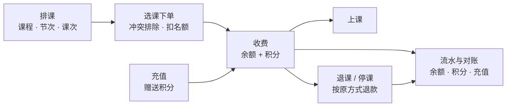
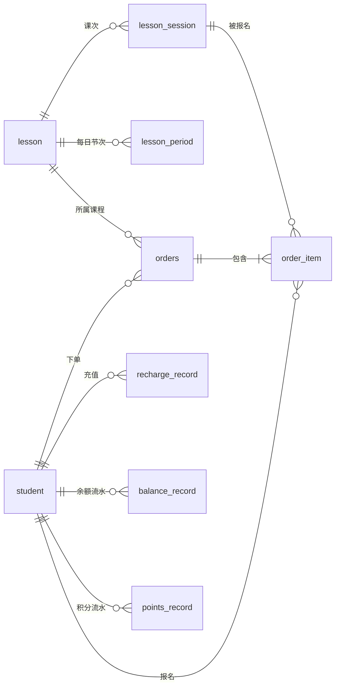
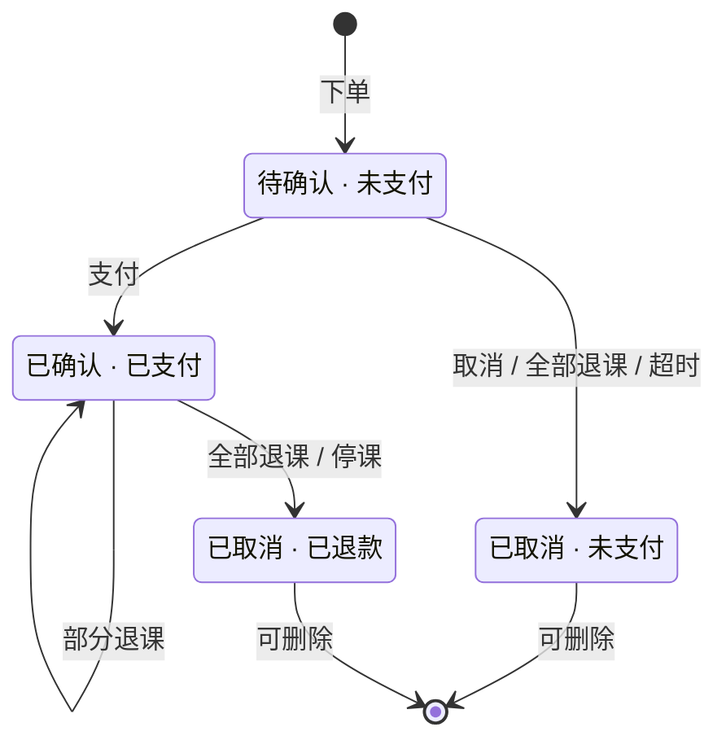

# 课程管理系统 需求规格说明书

| 项目 | 内容 |
|---|---|
| 文档名称 | 课程管理系统需求规格说明书（SRS） |
| 文档版本 | V1.0 |
| 编写日期 | 2026-09-30 |
| 对应系统版本 | lessonOrder `main` 分支 |
| 适用读者 | 项目负责人、开发人员、测试人员、运维人员、机构业务负责人 |

---

## 1. 引言

### 1.1 编写目的

本文档完整描述课程管理系统应当具备的功能、数据、接口、质量属性和业务规则，作为系统开发、测试验收、后续迭代和运维的共同依据。文档中的每一条需求都有唯一编号，可在测试和变更时引用。

### 1.2 系统范围

课程管理系统是一套供培训机构**内部员工**使用的后台管理系统，覆盖从“排课”到“收费、退费、对账”的完整业务链：

- 维护学生档案和学生账户（余额、积分）；
- 按“起止日期 + 每日节次”为课程排课，并按课次管理名额；
- 为学生选课下单，自动排除时间冲突；
- 使用“余额 + 积分”组合收费，支持按课次退课、按原支付方式退款；
- 记录每一笔余额和积分变动，保证可对账；
- 员工账号、角色权限与全量操作审计。

**不在本期范围内**：学生或家长自助登录、在线支付渠道（微信 / 支付宝）、考勤签到、教师排班、短信 / 邮件通知、数据报表导出。

### 1.3 术语与缩略语

| 术语 | 定义 |
|---|---|
| 课程（Lesson） | 一门可报名的课，包含标题、分类、单节价格、每节名额、开课 / 结课日期、每日节次 |
| 节次（Period） | 课程每天的一个上课时段，例如“第 1 节 09:00–10:30” |
| 课次（Session） | 某一天的某一节具体的课，由“日期 × 节次”展开得到；名额、报名、停课都以课次为单位 |
| 订单（Order） | 一个学生对一门课程若干课次的一次购买 |
| 订单明细（Order Item） | 订单中的一节课次 |
| 余额 | 学生账户中的储值金额，单位元，保留两位小数 |
| 积分 | 学生账户中的奖励点数，100 积分可抵扣 1 元 |
| 停课 | 管理员或教务取消某一个课次，该课次的全部报名自动退课退款 |
| 退课 | 从订单中退掉尚未开始的课次 |
| 期初余额 | 启用余额流水功能时，为已有余额的学生补记的一条流水 |
| SRS | Software Requirements Specification，需求规格说明书 |

### 1.4 参考资料

- 项目仓库：https://github.com/leideng1995/lessonOrder
- 《课程管理系统 用户指导手册》（`docs/用户指导手册.md`）
- 项目说明：`README.md`（系统架构与功能说明）

---

## 2. 总体描述

### 2.1 产品背景

培训机构的日常运营中，排课、报名、收费和退费通常分散在表格和人工记录里，容易出现超卖名额、学生课表冲突、退费金额算错、余额对不上账等问题。本系统将这些环节统一到一个系统中，由系统自动计算和校验，并留下完整流水和操作记录。

### 2.2 产品功能概述

| 编号 | 功能域 | 概述 |
|---|---|---|
| F1 | 登录与账号 | 员工登录、首次改密、修改密码、退出；登录失败锁定 |
| F2 | 用户与权限 | 员工账号管理；管理员 / 前台 / 教务三种角色，按角色控制菜单和操作 |
| F3 | 学生管理 | 学生档案增删改查；余额充值（赠送积分） |
| F4 | 课程排课 | 课程增删改、复制；按日期和节次自动生成课次；查看课次报名、停课 |
| F5 | 订单 | 选课下单、支付、退课、取消订单、超时自动取消 |
| F6 | 积分 | 支付获得、充值赠送、抵扣、退回、扣回 |
| F7 | 资金流水 | 充值记录、余额流水、积分记录 |
| F8 | 学生课表 | 按学生查看课程进度和按天课表 |
| F9 | 操作日志 | 登录记录、写操作、越权访问、系统自动操作 |

### 2.3 用户角色与特征

| 角色 | 典型使用者 | 主要工作 | 计算机水平 |
|---|---|---|---|
| **管理员** | 机构负责人、系统管理员 | 全部业务 + 员工账号管理 + 查看操作日志 | 熟练 |
| **前台** | 前台接待、财务 | 登记学生、充值、下单、收费、退课、查账 | 一般，会使用浏览器 |
| **教务** | 教务老师 | 排课、调整课程、停课、查看学生课表 | 一般 |

学生本人不直接使用本系统。

### 2.4 运行环境

| 类别 | 要求 |
|---|---|
| 服务器操作系统 | Windows / Linux / macOS 均可 |
| 运行时 | JDK 17 及以上 |
| 数据库 | MySQL 8.0，字符集 utf8mb4 |
| 客户端 | 近两年版本的 Chrome、Edge、Firefox、Safari；屏幕宽度 375px 及以上 |
| 网络 | 客户端与服务器同源访问（默认端口 8082） |

### 2.5 设计与实现约束

- 后端使用 Spring Boot 4 + MyBatis，前端使用原生 HTML / CSS / JavaScript，不引入前端框架和构建工具。
- 金额以“元”为单位保留两位小数；积分为整数。
- 所有资金相关的计算和校验必须在服务端完成，前端计算仅用于提示。
- 权限控制必须在服务端强制执行，前端隐藏菜单不作为安全措施。

### 2.6 假设与依赖

- 机构内部网络环境，服务器时间准确（课次是否“已开始”、订单是否“超时”都以服务器时间为准）。
- 系统部署为单实例；如需多实例部署，需评估登录失败计数（当前保存在内存中）的共享问题。
- 学生的线下缴费由员工在系统中以“充值”方式录入。

---

## 3. 功能需求

需求编号规则：`FR-模块-序号`。优先级：**高**（必须实现）、**中**（应当实现）、**低**（可以实现）。本期全部需求均已实现。

### 3.1 登录与账号（AUTH）

| 编号 | 需求 | 优先级 |
|---|---|---|
| FR-AUTH-01 | 员工使用用户名和密码登录；用户名不区分大小写，首尾空格忽略 | 高 |
| FR-AUTH-02 | 用户名不存在或密码错误时，统一提示“用户名或密码错误”，不暴露账号是否存在 | 高 |
| FR-AUTH-03 | 同一用户名连续 5 次密码错误，锁定 5 分钟；锁定期间即使密码正确也不能登录 | 高 |
| FR-AUTH-04 | 已停用的账号不能登录，提示“该账号已停用，请联系管理员” | 高 |
| FR-AUTH-05 | 未登录访问任何业务页面，自动跳转到登录页；登录成功后返回原页面 | 高 |
| FR-AUTH-06 | 新建账号或被管理员重置密码后，首次登录必须先修改密码；修改前不能访问任何业务数据 | 高 |
| FR-AUTH-07 | 已登录用户可随时修改自己的密码，需验证原密码；新密码不能与原密码相同 | 高 |
| FR-AUTH-08 | 员工密码规则：8~64 位，同时包含字母和数字 | 高 |
| FR-AUTH-09 | 用户可主动退出登录；会话 2 小时无操作自动过期 | 高 |
| FR-AUTH-10 | 系统首次启动且没有任何账号时，自动创建管理员 `admin`，随机初始密码只在启动日志中输出一次 | 高 |
| FR-AUTH-11 | 登录页可提供“重置管理员密码”入口（把 admin 重置为 123456 并要求登录后改密），该入口由配置开关控制，默认关闭 | 低 |

**验收标准**

- 连续输错 5 次后第 6 次（无论密码对错）返回“密码错误次数过多”。
- 使用初始密码登录后，打开任何业务页面都会弹出无法关闭的“请修改初始密码”对话框，直接调用业务接口返回 403。

### 3.2 用户与权限（USR / PERM）

| 编号 | 需求 | 优先级 |
|---|---|---|
| FR-USR-01 | 管理员可新增员工账号：用户名（3~32 位小写字母、数字或 `_ . -`，创建后不可修改）、姓名、角色、初始密码 | 高 |
| FR-USR-02 | 管理员可修改员工的姓名、角色、启用状态 | 高 |
| FR-USR-03 | 管理员可为员工重置密码，重置后该员工下次登录必须修改 | 高 |
| FR-USR-04 | 管理员不能停用自己，也不能修改自己的角色 | 高 |
| FR-USR-05 | 系统中必须至少保留一个启用状态的管理员 | 高 |
| FR-USR-06 | 账号不提供删除功能，离职人员以“停用”处理，以保留操作记录 | 中 |
| FR-PERM-01 | 系统提供管理员、前台、教务三种角色，各角色可见菜单和可执行操作见表 3-1 | 高 |
| FR-PERM-02 | 每个接口请求都在服务端校验权限；未登记权限的接口一律拒绝 | 高 |
| FR-PERM-03 | 停用账号或修改角色后立即生效，已登录的会话在下一次请求时按新状态处理 | 高 |
| FR-PERM-04 | 前端按当前用户角色显示菜单和按钮；直接访问无权限的页面时跳转到该用户有权限的第一个页面 | 中 |

**表 3-1 角色权限矩阵**

| 功能 | 管理员 | 前台 | 教务 |
|---|:-:|:-:|:-:|
| 查看学生列表、学生课表 | ✅ | ✅ | ✅ |
| 新增 / 编辑 / 删除学生、充值 | ✅ | ✅ | |
| 查看课程与课次 | ✅ | ✅ | ✅ |
| 新增 / 编辑 / 删除 / 复制课程、停课 | ✅ | | ✅ |
| 下单、支付、退课、取消 / 删除订单 | ✅ | ✅ | |
| 查看订单 | ✅ | ✅ | |
| 查看充值记录、余额流水、积分记录 | ✅ | ✅ | |
| 用户管理 | ✅ | | |
| 操作日志 | ✅ | | |

**各角色可见菜单**

- 管理员：学生、课程、订单、充值记录、余额流水、积分记录、学生课表、用户管理、操作日志
- 前台：学生、课程、订单、充值记录、余额流水、积分记录、学生课表
- 教务：课程、学生课表

### 3.3 学生管理（STU）

| 编号 | 需求 | 优先级 |
|---|---|---|
| FR-STU-01 | 新增学生：姓、名、邮箱（必填，唯一）、密码（至少 6 位）、手机、出生日期、初始余额（0~100000 元，可选） | 高 |
| FR-STU-02 | 编辑学生信息；密码留空表示不修改；余额不能通过编辑修改，只能通过充值、支付、退款变动 | 高 |
| FR-STU-03 | 删除学生；已有订单的学生不能删除 | 高 |
| FR-STU-04 | 学生列表支持按姓名、邮箱、手机号搜索，分页显示，显示余额和积分 | 高 |
| FR-STU-05 | 学生列表提供统计：学生总数、本月新增、积分总计、余额总计 | 低 |
| FR-STU-06 | 从学生行可快捷进入该学生的课表、充值记录、余额流水、积分记录 | 中 |
| FR-STU-07 | 学生密码只保存哈希值，系统中任何地方都不保存和返回明文 | 高 |

### 3.4 充值（RCG）

| 编号 | 需求 | 优先级 |
|---|---|---|
| FR-RCG-01 | 为学生充值，金额 0.01~100000 元，最多两位小数 | 高 |
| FR-RCG-02 | 充值同时赠送积分：每 1 元赠送 1 积分，向下取整（如 ¥123.45 赠送 123 积分） | 高 |
| FR-RCG-03 | 每笔充值生成充值记录（金额、充值后余额、赠送积分、时间），并写入余额流水和积分流水 | 高 |
| FR-RCG-04 | 充值、赠送积分、记录流水在同一事务中完成，任一步失败全部回滚 | 高 |
| FR-RCG-05 | 新建学生时的初始余额不视为充值，不赠送积分，但写入一条“开户余额”流水 | 中 |

### 3.5 课程与排课（LSN）

| 编号 | 需求 | 优先级 |
|---|---|---|
| FR-LSN-01 | 新增课程：标题（必填，≤200 字）、分类（≤50 字）、单节价格（≥0）、每节名额（≥1）、是否支持积分抵扣、开课日期、结课日期、每日节次、描述 | 高 |
| FR-LSN-02 | 每日节次 1~12 节，每节须填写开始和结束时间，结束晚于开始，各节之间不能重叠；系统按开始时间排序并编号 | 高 |
| FR-LSN-03 | 开课日期不晚于结课日期，跨度不超过 366 天 | 高 |
| FR-LSN-04 | 保存课程时，按“开课到结课的每一天 × 每一节”自动生成课次，每个课次的名额等于每节名额 | 高 |
| FR-LSN-05 | 修改日期、节次或名额时，自动同步课次：新增需要的课次，删除不再需要且无人报名过的课次 | 高 |
| FR-LSN-06 | 已有有效报名的课次不能被移除，也不能修改下课时间；名额不能改到少于任一课次的已报名人数；违反时整次修改被拒绝，并列出冲突的课次 | 高 |
| FR-LSN-07 | 可从已有课程复制新建：带出全部字段（含日期和节次），标题自动加“（副本）”，可再修改 | 中 |
| FR-LSN-08 | 已有订单的课程不能删除；没有订单的课程删除时，其节次和课次一并删除 | 高 |
| FR-LSN-09 | 课程列表显示：课程与分类、上课日期与每日节次、单节价格、报名人次 / 总名额、课次数、下一节课时间；支持按分类筛选、按标题和描述搜索 | 高 |
| FR-LSN-10 | 课程列表统计：课程总数、课次总数、报名人次、名额使用率 | 低 |
| FR-LSN-11 | 前台角色只能查看课程，不能新增、编辑、删除或停课 | 高 |

### 3.6 课次与停课（SES）

| 编号 | 需求 | 优先级 |
|---|---|---|
| FR-SES-01 | 查看某课程的全部课次：日期、时间、报名人数 / 名额、状态（正常 / 上课中 / 已结束 / 已停课） | 高 |
| FR-SES-02 | 管理员和教务可对未结束的正常课次执行停课 | 高 |
| FR-SES-03 | 停课后，该课次的全部有效报名自动退课；已支付的按原支付方式退款（见 FR-RFD） | 高 |
| FR-SES-04 | 停课不可撤销；已停课的课次不能再被报名 | 高 |
| FR-SES-05 | 停课过程中新的下单请求不能报进该课次（先改状态再处理报名） | 高 |

### 3.7 下单（ORD）

| 编号 | 需求 | 优先级 |
|---|---|---|
| FR-ORD-01 | 下单时依次选择学生、课程，再勾选该课程的一个或多个课次（一单最多 200 节） | 高 |
| FR-ORD-02 | 以下课次不可选：已停课、已开始、名额已满、该学生已报名、与该学生已报的任何课程时间重叠；页面上置灰并说明原因 | 高 |
| FR-ORD-03 | 服务端再次校验：课次属于该课程、未停课、未开始、所选课次之间不重叠、与该学生已报课程不冲突、名额充足；任一不满足则整单失败并说明具体课次 | 高 |
| FR-ORD-04 | 订单金额 = 单节价格 × 节数；单节价格在下单时快照保存，之后课程改价不影响已有订单 | 高 |
| FR-ORD-05 | 下单成功后订单为“待确认 · 未支付”，系统立即弹出支付窗口；关闭支付窗口后订单保持待支付 | 高 |
| FR-ORD-06 | 同一学生同一课次只能有一条有效报名（退课后可重新报名），由数据库唯一约束保证 | 高 |
| FR-ORD-07 | 名额扣减使用条件更新，并发下单不会超卖 | 高 |
| FR-ORD-08 | 订单列表显示：订单号、学生与课程、课次数、金额（含积分抵扣、已退、获得积分）、状态和剩余支付时间；支持按订单状态筛选，按订单号、学生、课程搜索 | 高 |
| FR-ORD-09 | 订单明细显示每节课的时间、单价、状态，以及支付方式、获得积分、退款构成、下单时间、取消原因 | 高 |
| FR-ORD-10 | 只有已取消的订单可以删除 | 中 |

### 3.8 支付（PAY）

| 编号 | 需求 | 优先级 |
|---|---|---|
| FR-PAY-01 | 只有“待确认 · 未支付”且未超时的订单可以支付 | 高 |
| FR-PAY-02 | 支付时可使用积分抵扣任意部分（0 到订单全额），其余从余额扣除；100 积分抵 1 元 | 高 |
| FR-PAY-03 | 课程设置为“不支持积分抵扣”时，只能使用余额支付，服务端拒绝使用积分的支付请求 | 高 |
| FR-PAY-04 | 积分不足或余额不足时支付失败，提示所需金额和当前余额 / 积分，不扣任何费用 | 高 |
| FR-PAY-05 | 支付成功后按余额实付金额 × 2 获得积分（向下取整）；积分抵扣部分不产生积分 | 高 |
| FR-PAY-06 | 支付窗口实时显示：积分抵扣金额、余额支付金额、支付后余额、本单可获得积分、支付截止时间 | 中 |
| FR-PAY-07 | 支付的扣积分、扣余额、获得积分、写流水、改订单状态在同一事务中完成 | 高 |
| FR-PAY-08 | 同一订单并发支付只会成功一次 | 高 |

### 3.9 退课与退款（RFD）

| 编号 | 需求 | 优先级 |
|---|---|---|
| FR-RFD-01 | 可在订单明细中退掉单节尚未开始的课次 | 高 |
| FR-RFD-02 | “取消订单”退掉订单中所有尚未开始的课次；已开始的课次保留、不退款；订单中所有课次都已开始时不能取消 | 高 |
| FR-RFD-03 | 退课归还课次名额 | 高 |
| FR-RFD-04 | 未支付订单退课：订单金额相应减少，不涉及资金 | 高 |
| FR-RFD-05 | 已支付订单退课：退款金额 = 退掉课次的单价之和，按原支付方式拆分退回：余额部分退回余额、积分部分退回积分，按订单剩余未退部分的比例拆分 | 高 |
| FR-RFD-06 | 订单最后一次退款（退后不再有有效课次）时，退回剩余的全部余额和积分，不再按比例计算，避免舍入误差累积 | 高 |
| FR-RFD-07 | 退款时扣回退掉部分对应的已得积分；学生积分不足时只扣到 0，在积分流水中注明应扣与实扣 | 高 |
| FR-RFD-08 | 订单全部课次退掉后，订单变为“已取消”；已支付的支付状态变为“已退款” | 高 |
| FR-RFD-09 | 同一课次重复退课只会退款一次 | 高 |

### 3.10 未支付订单超时（TMO）

| 编号 | 需求 | 优先级 |
|---|---|---|
| FR-TMO-01 | 订单下单后须在规定时间内支付，默认 30 分钟，可配置 | 高 |
| FR-TMO-02 | 系统每分钟检查一次（可配置），自动取消超时未支付的订单，归还名额，记录取消原因“超时未支付，系统自动取消” | 高 |
| FR-TMO-03 | 超过支付时限后，即使尚未被自动取消，也不能再支付 | 高 |
| FR-TMO-04 | 订单列表显示剩余支付时间，不超过 5 分钟时醒目提示；超时取消的订单标注“超时自动取消” | 中 |
| FR-TMO-05 | 自动取消逐单独立处理，一单失败不影响其他订单，下一轮重试 | 中 |

### 3.11 积分（PTS）

| 编号 | 需求 | 优先级 |
|---|---|---|
| FR-PTS-01 | 积分获得途径：支付（余额实付 × 2）、充值（充值金额 × 1），均向下取整 | 高 |
| FR-PTS-02 | 积分使用途径：支付时抵扣，100 积分 = 1 元 | 高 |
| FR-PTS-03 | 积分变动类型：支付获得、充值赠送、抵扣支付、退课退回、退课扣回；每次变动记录一条积分流水（变动数量、变动后积分、关联订单、说明、时间） | 高 |
| FR-PTS-04 | 学生积分不能为负数 | 高 |
| FR-PTS-05 | 积分记录页面按学生筛选，统计累计发放、累计抵扣、学生持有积分 | 中 |

### 3.12 资金流水（BAL）

| 编号 | 需求 | 优先级 |
|---|---|---|
| FR-BAL-01 | 余额的每一次变动都记录一条余额流水：开户余额、充值、支付、退款；包含变动金额、变动后余额、关联订单、说明、时间 | 高 |
| FR-BAL-02 | 每个学生的余额流水合计必须等于其当前余额 | 高 |
| FR-BAL-03 | 启用余额流水时，为已有余额的学生补记一条“期初余额”流水 | 高 |
| FR-BAL-04 | 余额流水、充值记录、积分记录均可按学生筛选，支持搜索 | 中 |
| FR-BAL-05 | 余额流水页统计：充值合计、支付合计、退款合计、学生余额总计 | 低 |
| FR-BAL-06 | 学生余额不能为负数 | 高 |

### 3.13 学生课表（SCH）

| 编号 | 需求 | 优先级 |
|---|---|---|
| FR-SCH-01 | 选择学生后，显示其报名的全部课次，可切换“待上课 / 全部 / 已退课” | 高 |
| FR-SCH-02 | 每节课显示时间、课程、状态（待上课 / 上课中 / 已上 / 已退课 / 停课退课）、是否未支付、订单号和单价 | 高 |
| FR-SCH-03 | 按课程汇总进度：已上 / 总节数、下一节课、未支付节数、退课节数 | 中 |
| FR-SCH-04 | 统计：在读课程、待上课次、已上课次、下一节课、未支付课次 | 低 |
| FR-SCH-05 | 页面地址记录所选学生，便于从学生列表直接跳转 | 低 |

> 说明：“已上”指课次的下课时间已过，系统暂无考勤功能，不代表学生实际出勤。

### 3.14 操作日志（LOG）

| 编号 | 需求 | 优先级 |
|---|---|---|
| FR-LOG-01 | 记录登录类事件：登录成功、登录失败（用户名不存在 / 密码错误 / 账号停用 / 锁定）、退出、修改密码、登录页重置管理员密码 | 高 |
| FR-LOG-02 | 记录全部写操作（新增、修改、删除、充值、下单、支付、退课、停课、用户管理等），无论成功或失败 | 高 |
| FR-LOG-03 | 记录已登录用户的越权访问（被拒绝的请求）及缺少的权限 | 高 |
| FR-LOG-04 | 记录系统自动操作（超时自动取消订单） | 中 |
| FR-LOG-05 | 每条日志包含：时间、类型、操作名称、操作人（用户名、姓名、角色）、请求方法与路径、请求内容、是否成功、失败原因、IP、浏览器、耗时 | 高 |
| FR-LOG-06 | 请求内容中的所有密码字段打码为 `***`，日志中任何位置都不得出现明文密码（包括登录时输错的密码） | 高 |
| FR-LOG-07 | 业务操作失败回滚时，日志仍然保留 | 高 |
| FR-LOG-08 | 查询类请求不记录 | 中 |
| FR-LOG-09 | 仅管理员可查看日志；支持按类型筛选，按用户、操作、IP、内容、失败原因搜索；显示最近 2000 条 | 高 |
| FR-LOG-10 | 日志页统计：今日登录、今日登录失败、今日操作、今日失败 / 越权 | 低 |

### 3.15 通用界面（UI）

| 编号 | 需求 | 优先级 |
|---|---|---|
| FR-UI-01 | 所有列表页提供统一的搜索、筛选、分页、刷新、新增和行内操作 | 高 |
| FR-UI-02 | 每行最多直接显示 2 个操作按钮，其余收进“更多”菜单；删除等危险操作默认放入菜单 | 中 |
| FR-UI-03 | 所有删除、停课、退课、取消、支付等操作须二次确认，确认框说明后果（如退款金额） | 高 |
| FR-UI-04 | 操作成功后显示提示，失败时在对话框内显示服务端返回的具体原因 | 高 |
| FR-UI-05 | 页面在 375px 到 1920px 宽度范围内均不出现横向滚动：1180px 以下侧边栏收为图标栏，900px 以下表格改为卡片布局 | 中 |
| FR-UI-06 | 侧边栏显示当前用户姓名、用户名、角色，提供修改密码和退出登录入口 | 高 |
| FR-UI-07 | 页面显示接口连接状态和响应耗时 | 低 |

---

## 4. 数据需求

### 4.1 主要实体关系

### 4.2 数据字典（主要字段）

| 表 | 说明 | 主要字段 |
|---|---|---|
| `student` | 学生 | 学生 ID、姓、名、邮箱（唯一）、密码哈希、手机、出生日期、余额（≥0）、积分（≥0）、注册时间 |
| `lesson` | 课程 | 课程 ID、标题、描述、单节价格、分类、开课日期、结课日期、每节名额（>0）、是否支持积分抵扣 |
| `lesson_period` | 每日节次 | 节次 ID、课程 ID、第几节、开始时间、结束时间 |
| `lesson_session` | 课次 | 课次 ID、课程 ID、节次 ID、开始时间、结束时间、名额、剩余名额（0~名额）、状态（正常 / 已停课） |
| `orders` | 订单 | 订单 ID、学生 ID、课程 ID、订单金额、已退款金额、余额支付、积分支付、获得积分、已退余额、已退积分、扣回积分、订单状态、支付状态、下单时间、取消原因 |
| `order_item` | 订单明细 | 明细 ID、订单 ID、课次 ID、学生 ID、单节价格快照、状态（有效 / 已退课） |
| `recharge_record` | 充值记录 | 记录 ID、学生 ID、充值金额（>0）、充值后余额、赠送积分、时间 |
| `balance_record` | 余额流水 | 记录 ID、学生 ID、订单 ID、变动金额、变动后余额、类型（期初 / 开户 / 充值 / 支付 / 退款）、说明、时间 |
| `points_record` | 积分流水 | 记录 ID、学生 ID、订单 ID、变动数量、变动后积分、类型（获得 / 抵扣 / 退回 / 扣回 / 充值赠送）、说明、时间 |
| `sys_user` | 员工账号 | 用户 ID、用户名（唯一）、密码哈希、姓名、角色、是否启用、是否需要改密码、创建时间、最近登录时间 |
| `operation_log` | 操作日志 | 日志 ID、类型、操作名称、操作人、请求方法与路径、请求内容、是否成功、状态码、失败原因、IP、浏览器、耗时、时间 |

### 4.3 数据状态

**订单状态 × 支付状态**

| 订单状态 | 支付状态 | 含义 |
|---|---|---|
| 待确认 | 未支付 | 已下单，等待支付（有支付时限） |
| 已确认 | 已支付 | 已支付，可能有部分课次已退 |
| 已取消 | 未支付 | 未支付即取消（手动、全部退课或超时） |
| 已取消 | 已退款 | 已支付后全部退掉 |

### 4.4 数据完整性约束

| 编号 | 约束 |
|---|---|
| DR-01 | 学生余额 ≥ 0，学生积分 ≥ 0（数据库 CHECK 约束 + 条件更新） |
| DR-02 | 课次剩余名额在 0 到名额之间 |
| DR-03 | 同一学生同一课次只能有一条有效报名（唯一索引） |
| DR-04 | 同一课程同一开始时间只有一个课次（唯一索引） |
| DR-05 | 订单已退款金额在 0 到订单金额之间 |
| DR-06 | 有订单的课程、有订单的学生不能删除（外键约束） |
| DR-07 | 删除学生时，其充值记录、余额流水、积分流水一并删除 |
| DR-08 | 订单删除后，流水中的订单号保留（不设外键），以保证资金记录完整 |

### 4.5 数据迁移

数据库结构变更以版本化 SQL 脚本管理（`src/main/resources/db/V2` ~ `V10`），脚本按 Flyway 命名规则编写。历史数据迁移要求：

- 已有订单迁移为订单明细，名额按明细重新计算；
- 已有明文密码在系统启动时自动转换为哈希；
- 已有余额补记“期初余额”流水；
- 已有已支付订单标记为全额余额支付，不补发积分。

---

## 5. 外部接口需求

### 5.1 用户界面

| 页面 | 地址 | 可访问角色 |
|---|---|---|
| 登录 | `/login.html` | 所有人 |
| 学生 | `/students.html` | 管理员、前台 |
| 课程 | `/lessons.html` | 管理员、前台（只读）、教务 |
| 订单 | `/orders.html` | 管理员、前台 |
| 充值记录 | `/recharges.html` | 管理员、前台 |
| 余额流水 | `/balance.html` | 管理员、前台 |
| 积分记录 | `/points.html` | 管理员、前台 |
| 学生课表 | `/schedule.html` | 全部角色 |
| 用户管理 | `/users.html` | 管理员 |
| 操作日志 | `/logs.html` | 管理员 |

### 5.2 软件接口（REST API）

- 协议：HTTP,JSON 请求和响应，路径前缀 `/api`。
- 认证：服务端会话，会话 Cookie 为 `HttpOnly`、`SameSite=Strict`。
- 错误响应：HTTP 状态码 + `{"message": "具体原因"}`；400 参数错误、401 未登录、403 无权限、404 不存在、409 业务冲突（名额已满、余额不足、状态已变化等）、429 登录锁定。

| 模块 | 方法与路径 | 说明 |
|---|---|---|
| 登录 | `POST /auth/login` | 登录 |
| | `POST /auth/logout` | 退出 |
| | `GET /auth/me` | 当前用户、权限、菜单 |
| | `PUT /auth/password` | 修改自己的密码 |
| | `GET /auth/options` · `POST /auth/reset-admin` | 登录页选项 · 重置管理员密码（可配置关闭） |
| 学生 | `GET /students` · `POST /students` | 列表 · 新增 |
| | `GET/PUT/DELETE /students/{id}` | 查看 · 修改 · 删除 |
| | `POST /students/{id}/recharge` | 充值 `{"amount": 100}` |
| | `GET /students/{id}/schedule` | 学生课表 |
| 课程 | `GET /lessons` · `POST /lessons` | 列表 · 新增 |
| | `GET/PUT/DELETE /lessons/{id}` | 查看 · 修改 · 删除 |
| | `GET /lessons/{id}/sessions` | 课次列表 |
| | `PUT /lessons/{id}/sessions/{sessionId}/cancel` | 停课 |
| 订单 | `GET /orders` · `POST /orders` | 列表 · 下单 `{"studentId", "lessonId", "sessionIds": []}` |
| | `GET/DELETE /orders/{id}` | 明细 · 删除 |
| | `PUT /orders/{id}/pay` | 支付 `{"points": 500}` |
| | `PUT /orders/{id}/cancel` | 取消订单 |
| | `PUT /orders/{id}/items/{itemId}/cancel` | 退一节课 |
| 流水 | `GET /recharges` · `GET /balance` · `GET /points` | 充值记录 · 余额流水 · 积分记录（可带 `studentId`） |
| | `GET /points/rule` | 积分规则 |
| 用户 | `GET /users` · `POST /users` · `GET /users/roles` | 列表 · 新增 · 角色列表 |
| | `PUT /users/{id}` · `PUT /users/{id}/password` | 修改 · 重置密码 |
| 日志 | `GET /logs?category=&limit=` | 操作日志 |

### 5.3 硬件与通信接口

无专用硬件接口。浏览器与服务器通过 HTTP 通信，生产部署建议在前端增加 HTTPS 反向代理。

---

## 6. 非功能需求

### 6.1 性能

| 编号 | 需求 |
|---|---|
| NFR-PERF-01 | 在数百学生、数十门课程规模下，常用查询和操作的服务端响应时间应在 1 秒以内（本地测试环境实测约 10~30 毫秒） |
| NFR-PERF-02 | 登录时密码哈希计算约数百毫秒，属于有意设计的安全开销，可接受 |
| NFR-PERF-03 | 列表数据当前一次加载、前端分页；数据量达到上万条前应改为后端分页（见第 9 章） |

### 6.2 安全

| 编号 | 需求 |
|---|---|
| NFR-SEC-01 | 员工和学生密码使用 PBKDF2-HMAC-SHA512、随机盐、210000 次迭代哈希存储；任何接口都不返回密码或哈希 |
| NFR-SEC-02 | 密码校验使用常量时间比较；用户名不存在时仍执行一次哈希计算，防止通过响应时间判断账号是否存在 |
| NFR-SEC-03 | 登录成功后换发新会话，防止会话固定攻击 |
| NFR-SEC-04 | 会话 Cookie 设置 `HttpOnly` 和 `SameSite=Strict`，防止脚本窃取和跨站请求伪造 |
| NFR-SEC-05 | 所有 `/api` 请求在服务端校验登录和权限，未登记的接口默认拒绝 |
| NFR-SEC-06 | 登录页跳转地址只接受本站相对路径，防止开放重定向 |
| NFR-SEC-07 | 页面输出的所有用户数据经过 HTML 转义，防止跨站脚本 |
| NFR-SEC-08 | “重置管理员密码”入口在生产环境必须关闭 |
| NFR-SEC-09 | 数据库账号密码在生产环境应通过环境变量或不入库的配置提供 |

### 6.3 可靠性与数据一致性

| 编号 | 需求 |
|---|---|
| NFR-REL-01 | 涉及资金和名额的操作在单个数据库事务中完成，任一步失败全部回滚 |
| NFR-REL-02 | 扣名额、扣余额、扣积分、改订单状态均使用条件更新，并发下不超卖、不透支、不重复扣款、不重复退款 |
| NFR-REL-03 | 修改订单的操作统一按“学生 → 订单 → 课次”顺序加锁，避免死锁 |
| NFR-REL-04 | 任意时刻，每个学生的余额流水合计等于当前余额，积分流水最后一条的变动后积分等于当前积分 |
| NFR-REL-05 | 数据库结构变更前应备份数据 |

### 6.4 易用性

| 编号 | 需求 |
|---|---|
| NFR-USE-01 | 所有界面文字、提示和错误信息使用中文，错误信息说明具体原因和涉及的对象（如哪一节课、差多少钱） |
| NFR-USE-02 | 不可用的选项置灰并说明原因，而不是等提交后才报错 |
| NFR-USE-03 | 危险操作二次确认，并在确认框中说明后果 |
| NFR-USE-04 | 页面遵循无障碍基本要求：表单有标签、按钮有文字或 `aria-label`、支持键盘操作、尊重“减少动效”系统设置 |

### 6.5 兼容性

| 编号 | 需求 |
|---|---|
| NFR-COMP-01 | 支持主流桌面和移动浏览器的近两年版本 |
| NFR-COMP-02 | 375px~1920px 宽度下无横向滚动，内容完整可用 |

### 6.6 可维护性与可审计性

| 编号 | 需求 |
|---|---|
| NFR-MNT-01 | 角色、权限、菜单的对应关系集中定义在一处 |
| NFR-MNT-02 | 积分规则（换算比例、获得倍数）集中定义在一处 |
| NFR-MNT-03 | 支付时限、超时检查间隔、会话时长、重置入口开关可通过配置文件修改，无需改代码 |
| NFR-MNT-04 | 新增列表页面只需声明字段、列和操作，复用通用列表引擎 |
| NFR-AUD-01 | 所有写操作可追溯到操作人、时间、IP 和请求内容 |

---

## 7. 业务规则汇总

| 编号 | 规则 |
|---|---|
| BR-01 | 100 积分 = 1 元 |
| BR-02 | 支付获得积分 = 余额实付金额 × 2，向下取整；积分抵扣部分不产生积分 |
| BR-03 | 充值赠送积分 = 充值金额 × 1，向下取整；新建学生时的初始余额不赠送 |
| BR-04 | 积分抵扣上限为订单全额；课程可设置不支持积分抵扣 |
| BR-05 | 订单金额 = 单节价格 × 节数，单节价格在下单时锁定 |
| BR-06 | 下单后 30 分钟内未支付自动取消，归还名额 |
| BR-07 | 只能退尚未开始的课次；已开始的课次不退款 |
| BR-08 | 已支付订单退款按原支付方式、按剩余比例拆分为余额和积分；最后一次退款退回剩余全部 |
| BR-09 | 退款时扣回对应的已得积分，积分不足时只扣到 0 |
| BR-10 | 停课时该课次所有报名全额退课退款 |
| BR-11 | 同一学生不能同时报名时间重叠的课次（跨课程） |
| BR-12 | 已有报名的课次不能被删除或改时间；已有订单的课程和学生不能删除 |
| BR-13 | 只有已取消的订单可以删除 |
| BR-14 | 系统至少保留一个启用的管理员；管理员不能停用自己或改自己的角色 |

**计算示例**

| 场景 | 计算 | 结果 |
|---|---|---|
| ¥200 订单，用 400 积分 | 积分抵 ¥4，余额付 ¥196，获得 196 × 2 = 392 积分 | 余额 −196，积分 −400 + 392 |
| 上述订单退一节 ¥100 | 剩余：积分 400、余额 196，按比例退积分 200(¥2)、退余额 ¥98；扣回 196 积分 | 余额 +98，积分 +200 − 196 |
| 再退最后一节 | 退回剩余积分 200、余额 ¥98；扣回剩余 196 积分 | 学生回到下单前状态 |
| 充值 ¥123.45 | 赠送 123.45 × 1 = 123.45，向下取整为 123 积分 | 余额 +123.45，积分 +123 |

---

## 8. 需求追踪与验收

### 8.1 功能域与实现对照

| 功能域 | 需求编号 | 页面 | 服务端实现 |
|---|---|---|---|
| 登录与账号 | FR-AUTH-* | `login.html`、侧边栏 | `AuthController`、`AuthService`、`SecurityBootstrap` |
| 用户与权限 | FR-USR-*、FR-PERM-* | `users.html` | `UserController`、`UserService`、`Role`、`AuthInterceptor` |
| 学生 | FR-STU-* | `students.html` | `StudentController`、`StudentService` |
| 充值 | FR-RCG-* | `students.html`、`recharges.html` | `StudentService.recharge`、`RechargeRecordController` |
| 课程与课次 | FR-LSN-*、FR-SES-* | `lessons.html` | `LessonController`、`LessonService`、`OrderService.cancelSession` |
| 下单、支付、退款 | FR-ORD-*、FR-PAY-*、FR-RFD-* | `orders.html` | `OrderController`、`OrderService` |
| 超时取消 | FR-TMO-* | `orders.html` | `OrderTimeoutJob`、`OrderService.cancelExpired` |
| 积分 | FR-PTS-* | `points.html` | `PointsService`、`PointsController` |
| 资金流水 | FR-BAL-* | `balance.html` | `BalanceService`、`BalanceController` |
| 学生课表 | FR-SCH-* | `schedule.html` | `OrderService.schedule` |
| 操作日志 | FR-LOG-* | `logs.html` | `OpLogService`、`AuthInterceptor`、`LogController` |

### 8.2 关键验收用例

| 编号 | 用例 | 预期结果 |
|---|---|---|
| AT-01 | 连续 5 次输错密码 | 第 5 次提示锁定，5 分钟内无法登录 |
| AT-02 | 前台账号调用新增课程接口 | 403，操作日志记录一条越权 |
| AT-03 | 名额为 2 的课次，第 3 个学生报名 | 失败，提示“名额已满” |
| AT-04 | 学生已报 10-20 08:00-09:30，再报同日 08:30-09:00 的另一门课 | 页面置灰“时间冲突”；直接提交返回 409 并说明冲突的课 |
| AT-05 | ¥200 订单用 400 积分支付，再退一节、再退一节 | 金额与积分符合第 7 章计算示例，最终回到下单前状态 |
| AT-06 | 学生已花掉获得的积分后退课 | 积分扣到 0，积分流水注明“应扣 X，积分不足只扣 Y” |
| AT-07 | 下单后 30 分钟不支付 | 订单自动取消、名额归还；超时后支付被拒 |
| AT-08 | 停课一个已有 1 名学生支付的课次 | 该学生按原支付方式退款，课次显示已停课 |
| AT-09 | 修改课程日期，去掉已有人报名的日期 | 修改被拒绝，并列出冲突课次 |
| AT-10 | 全库核对 | 每个学生的余额流水合计 = 当前余额 |
| AT-11 | 搜索操作日志中的测试密码字符串 | 查不到任何明文密码 |
| AT-12 | 在 375px、820px、1024px、1920px 宽度打开各列表页 | 均无横向滚动 |

---

## 9. 已知限制与后续规划

| 类别 | 内容 |
|---|---|
| 数据库 | 缺少最初三张基础表（`student`、`lesson`、`orders`）的 V1 建表脚本；迁移脚本尚未接入 Flyway 自动执行 |
| 测试 | 尚无纳入仓库的自动化测试 |
| 性能 | 列表一次性加载、前端分页；操作日志无自动清理 |
| 部署 | 登录失败计数保存在内存中，重启清零、不支持多实例共享；部署在反向代理后需配置真实客户端 IP |
| 配置 | 数据库账号密码写在配置文件中，生产环境需改为环境变量 |
| 功能规划 | 考勤签到、请假调课、教师角色、周课表视图、数据看板、Excel 导出、候补名单、积分手动调整与有效期、学生 / 家长端 |
